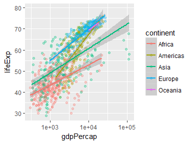
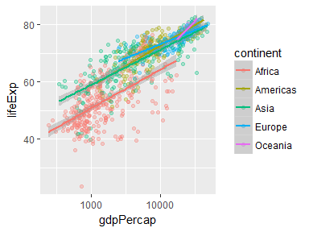
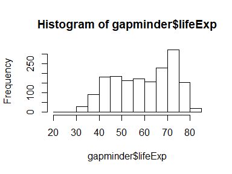
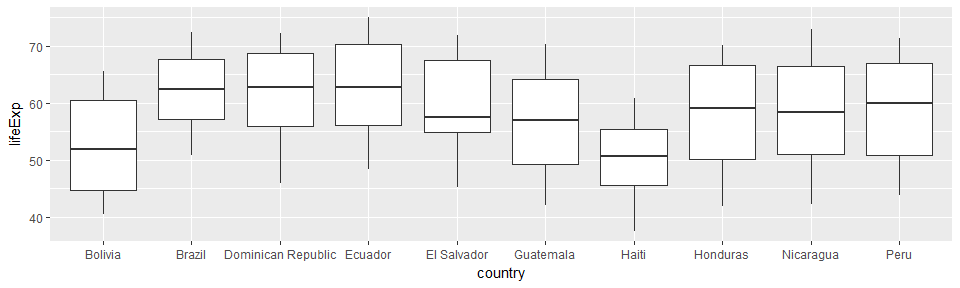
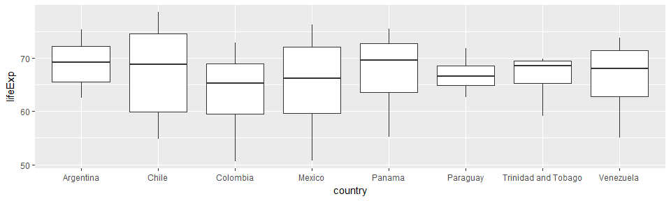
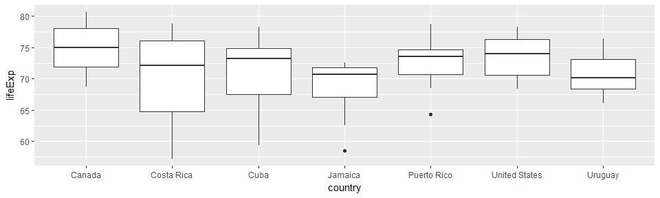

hw02\_yeonuk: Explore Gapminder and use dplyr
================
Yeonuk
September 26, 2017

### Report my process

> I just followed the hw02 instruction from bringing data to making figures.
>
> One problem which I've suffered from is that I do not understand the exact meaning of *class*. Frankly speaking, I am not sure my answer for *class* is correct or not.
>
> Using the function *kable* is the most easiest thing although I haven't learn in class. Also the tables modified by this function look tidy. I think it is pretty useful when using markdown.

#### 1. Bring rectangular data in

``` r
suppressPackageStartupMessages(library(tidyverse)) 
suppressPackageStartupMessages(library(gapminder))
knitr::opts_chunk$set(fig.width=4, fig.height=3)
```

#### 2. Smell test the data

-   Is it a data.frame, a matrix, a vector, a list?
    -   Answer: **data.frame** (see the below resut)
-   What’s its class?
    -   Answer: **tbl\_df** and **tbl** (see the below resut)

``` r
str(gapminder)
```

    ## Classes 'tbl_df', 'tbl' and 'data.frame':    1704 obs. of  6 variables:
    ##  $ country  : Factor w/ 142 levels "Afghanistan",..: 1 1 1 1 1 1 1 1 1 1 ...
    ##  $ continent: Factor w/ 5 levels "Africa","Americas",..: 3 3 3 3 3 3 3 3 3 3 ...
    ##  $ year     : int  1952 1957 1962 1967 1972 1977 1982 1987 1992 1997 ...
    ##  $ lifeExp  : num  28.8 30.3 32 34 36.1 ...
    ##  $ pop      : int  8425333 9240934 10267083 11537966 13079460 14880372 12881816 13867957 16317921 22227415 ...
    ##  $ gdpPercap: num  779 821 853 836 740 ...

-   How many variables/columns?
    -   Answer: **6** (see the below resut)
-   How many rows/observations?
    -   Answer: **1704** (see the below resut)

``` r
c(ncol(gapminder), nrow(gapminder))
```

    ## [1]    6 1704

-   Can you get these facts about “extent” or “size” in more than one way? Can you imagine different functions being useful in different contexts?
    -   Answer: I also can use the *str* function to get the numbers of variables and rows (see the first result). As for using different functions, the data types of the *ncol* function and the *nrow* function are *integer* (see the bellow result), so these functions can be used when I need to compute something from the data size (see the bellow example: computing the total number of components).

``` r
typeof(c(ncol(gapminder), nrow(gapminder)))
```

    ## [1] "integer"

``` r
(n_total <- ncol(gapminder)*nrow(gapminder)) # 6 * 1704 = 10224
```

    ## [1] 10224

-   What data type is each variable?
    -   Answer: country & continent = *Factor*, year & pop = *int*, lifeExp & gdpPercap = *num* (see the first result)

#### 3. Explore individual variables

-   Pick **at least** one categorical variable and at least one quantitative variable to explore.
    -   I used two categorial variables *year, continent (select Asia only)* and one quantitative variable *lifeExp*
-   What are possible values (or range, whichever is appropriate) of each variable?
-   What values are typical? What's the spread? What's the distribution? Etc., tailored to the variable at hand.
    -   Answer: see the bellow summarized table

``` r
STAT <- gapminder %>% group_by(year) %>% filter(continent=="Asia") %>%
                      summarize(MAX = max(lifeExp), MIN = min(lifeExp), 
                      MEAN = mean(lifeExp), SD = sd(lifeExp), 
                      Q1 = quantile(lifeExp,probs=0.25), 
                      Q2 = quantile(lifeExp,probs=0.5),
                      Q3 = quantile(lifeExp,probs=0.75))
knitr::kable(STAT) # life expectation statistic for each year in Asia
```

|  year|     MAX|     MIN|      MEAN|         SD|        Q1|      Q2|      Q3|
|-----:|-------:|-------:|---------:|----------:|---------:|-------:|-------:|
|  1952|  65.390|  28.801|  46.31439|   9.291751|  39.41700|  44.869|  50.939|
|  1957|  67.840|  30.332|  49.31854|   9.635429|  41.90500|  48.284|  54.081|
|  1962|  69.390|  31.997|  51.56322|   9.820632|  44.50136|  49.325|  56.923|
|  1967|  71.430|  34.020|  54.66364|   9.650965|  47.83800|  53.655|  59.942|
|  1972|  73.420|  36.088|  57.31927|   9.722700|  51.92900|  56.950|  63.983|
|  1977|  75.380|  31.220|  59.61056|  10.022197|  55.49100|  60.765|  65.949|
|  1982|  77.110|  39.854|  62.61794|   8.535221|  57.48900|  63.739|  68.757|
|  1987|  78.670|  40.822|  64.85118|   8.203792|  60.13700|  66.295|  69.810|
|  1992|  79.360|  41.674|  66.53721|   8.075549|  60.83800|  68.690|  71.197|
|  1997|  80.690|  41.763|  68.02052|   8.091171|  61.81800|  70.265|  72.499|
|  2002|  82.000|  42.129|  69.23388|   8.374595|  63.61000|  71.028|  74.193|
|  2007|  82.603|  43.828|  70.72848|   7.963724|  65.48300|  72.396|  75.635|

#### 4. Explore various plot types & Use *filter()*, *select()* and *%&gt;%*

Make a few plots, probably of the same variable you chose to characterize numerically. Try to explore more than one plot type. **Just as an example** of what I mean:

-   A scatterplot of two quantitative variables.

``` r
p1 <- gapminder %>% filter(year<1980) %>% 
  ggplot(aes(gdpPercap, lifeExp, colour=continent))
p2 <- gapminder %>% filter(year>=1980) %>% 
  ggplot(aes(gdpPercap, lifeExp, colour=continent))
p1+geom_point(alpha=0.3) + scale_x_log10() + geom_smooth(method="lm") # before 1980
```



``` r
p2+geom_point(alpha=0.3) + scale_x_log10() + geom_smooth(method="lm") # after 1980
```



-   A plot of one quantitative variable. Maybe a histogram or densityplot or frequency polygon.

``` r
hist(gapminder$lifeExp)
```



-   A plot of one quantitative variable and one categorical. Maybe boxplots for several continents or countries.

``` r
p3 <- gapminder %>% filter(continent %in% c("Americas")) %>% 
  group_by(country) %>% filter(median(lifeExp)<65) %>%
  ggplot(aes(country, lifeExp))
p4 <- gapminder %>% filter(continent %in% c("Americas")) %>% 
  group_by(country) %>% filter(median(lifeExp)>=65 & median(lifeExp)<70) %>%
  ggplot(aes(country, lifeExp))
p5 <- gapminder %>% filter(continent %in% c("Americas")) %>% 
  group_by(country) %>% filter(median(lifeExp)>=70) %>%
  ggplot(aes(country, lifeExp))
p3+geom_boxplot() # American countries with low lifeExp
```



``` r
p4+geom_boxplot() # American countries with intermediate lifeExp
```



``` r
p5+geom_boxplot() # American countries with high lifeExp
```



#### 5. But I want to do more!

*For people who want to take things further.*

Evaluate this code and describe the result. Presumably the analyst's intent was to get the data for Rwanda and Afghanistan. Did they succeed? Why or why not? If not, what is the correct way to do this?

> filter(gapminder, country == c("Rwanda", "Afghanistan"))

**The above code is wrong. One country variable cannot be same with the vector. The correct result can come from the code I made:**

``` r
a <- filter(gapminder, country %in% c("Rwanda", "Afghanistan"))
knitr::kable(a)
```

| country     | continent |  year|  lifeExp|       pop|  gdpPercap|
|:------------|:----------|-----:|--------:|---------:|----------:|
| Afghanistan | Asia      |  1952|   28.801|   8425333|   779.4453|
| Afghanistan | Asia      |  1957|   30.332|   9240934|   820.8530|
| Afghanistan | Asia      |  1962|   31.997|  10267083|   853.1007|
| Afghanistan | Asia      |  1967|   34.020|  11537966|   836.1971|
| Afghanistan | Asia      |  1972|   36.088|  13079460|   739.9811|
| Afghanistan | Asia      |  1977|   38.438|  14880372|   786.1134|
| Afghanistan | Asia      |  1982|   39.854|  12881816|   978.0114|
| Afghanistan | Asia      |  1987|   40.822|  13867957|   852.3959|
| Afghanistan | Asia      |  1992|   41.674|  16317921|   649.3414|
| Afghanistan | Asia      |  1997|   41.763|  22227415|   635.3414|
| Afghanistan | Asia      |  2002|   42.129|  25268405|   726.7341|
| Afghanistan | Asia      |  2007|   43.828|  31889923|   974.5803|
| Rwanda      | Africa    |  1952|   40.000|   2534927|   493.3239|
| Rwanda      | Africa    |  1957|   41.500|   2822082|   540.2894|
| Rwanda      | Africa    |  1962|   43.000|   3051242|   597.4731|
| Rwanda      | Africa    |  1967|   44.100|   3451079|   510.9637|
| Rwanda      | Africa    |  1972|   44.600|   3992121|   590.5807|
| Rwanda      | Africa    |  1977|   45.000|   4657072|   670.0806|
| Rwanda      | Africa    |  1982|   46.218|   5507565|   881.5706|
| Rwanda      | Africa    |  1987|   44.020|   6349365|   847.9912|
| Rwanda      | Africa    |  1992|   23.599|   7290203|   737.0686|
| Rwanda      | Africa    |  1997|   36.087|   7212583|   589.9445|
| Rwanda      | Africa    |  2002|   43.413|   7852401|   785.6538|
| Rwanda      | Africa    |  2007|   46.242|   8860588|   863.0885|
