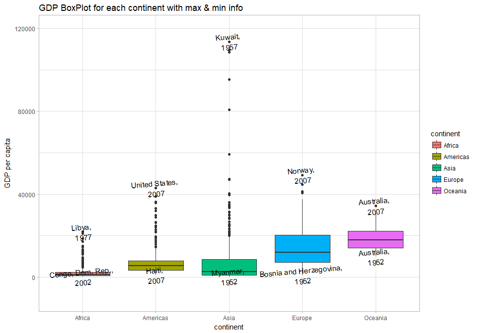

hw03: manipulate & explore data (dplyr, ggplot2)
================
Yeonuk
September 28, 2017

##### Packages which I used

``` r
suppressPackageStartupMessages(library(tidyverse)) 
suppressPackageStartupMessages(library(gapminder))
suppressPackageStartupMessages(library(cowplot))
knitr::opts_chunk$set(fig.width=10, fig.height=7)
```

Report my process
-----------------

> I worked for **4 tasks** (1st, 2nd, 4th, and 6th tasks). I tried my best to analyze Gapminder data set. All the tasks include figures and tables.
>
> *Please enjoy the results!!*

Homework
--------

### Task 1: Get the maximum and minimum of GDP per capita for all continents.

-   See the table and boxplot.

``` r
# extract max and min of gdpPercap
T10 <- gapminder %>% group_by(continent) %>% 
  summarise(MAX = max(gdpPercap),MIN = min(gdpPercap)) 

# extract country and year which are with max and min of gdpPercap
T11 <- gapminder %>% filter(gdpPercap %in% T10$MAX) %>% 
  mutate(MAX_info = paste(country, year, sep=", ")) %>% select(continent, MAX_info) 
T12 <- gapminder %>% filter(gdpPercap %in% T10$MIN) %>% 
  mutate(MIN_info = paste(country, year, sep=", ")) %>% select(continent, MIN_info)

# rearrange by name of continent (alphabet)
T11 <- arrange(T11, continent) 
T12 <- arrange(T12, continent)

# merge data and make table
T1 <- data.frame(T10, MAX_info=T11$MAX_info, MIN_info=T12$MIN_info)
knitr::kable(T1)  
```

| continent |        MAX|         MIN| MAX\_info           | MIN\_info                    |
|:----------|----------:|-----------:|:--------------------|:-----------------------------|
| Africa    |   21951.21|    241.1659| Libya, 1977         | Congo, Dem. Rep., 2002       |
| Americas  |   42951.65|   1201.6372| United States, 2007 | Haiti, 2007                  |
| Asia      |  113523.13|    331.0000| Kuwait, 1957        | Myanmar, 1952                |
| Europe    |   49357.19|    973.5332| Norway, 2007        | Bosnia and Herzegovina, 1952 |
| Oceania   |   34435.37|  10039.5956| Australia, 2007     | Australia, 1952              |

``` r
#drawing boxplot with texts (country, year) on max and min points
P1 <- gapminder %>% ggplot(aes(continent, gdpPercap))
P1 + geom_boxplot(aes(fill=continent)) +
     geom_text(aes(label=ifelse(gdpPercap %in% c(T1$MAX,T1$MIN), 
                                paste(country,year,sep=", \n"),''), angle=5)) +
     scale_y_continuous(limits=c(-10000,120000)) +
     theme_light()+ labs(y="GDP per capita", title="GDP BoxPlot for each continent with max & min info")
```



### Task 2: Look at the spread of GDP per capita within the continents.

``` r
T2 <- gapminder %>% group_by(continent) %>% 
                      summarize(MAX = max(gdpPercap), MIN = min(gdpPercap), 
                      MEAN = mean(gdpPercap), SD = sd(gdpPercap), 
                      Q1 = quantile(gdpPercap,probs=0.25), 
                      Q2 = quantile(gdpPercap,probs=0.5),
                      Q3 = quantile(gdpPercap,probs=0.75))
knitr::kable(T2)  
```

| continent |        MAX|         MIN|       MEAN|         SD|         Q1|         Q2|         Q3|
|:----------|----------:|-----------:|----------:|----------:|----------:|----------:|----------:|
| Africa    |   21951.21|    241.1659|   2193.755|   2827.930|    761.247|   1192.138|   2377.417|
| Americas  |   42951.65|   1201.6372|   7136.110|   6396.764|   3427.779|   5465.510|   7830.210|
| Asia      |  113523.13|    331.0000|   7902.150|  14045.373|   1056.993|   2646.787|   8549.256|
| Europe    |   49357.19|    973.5332|  14469.476|   9355.213|   7213.085|  12081.749|  20461.386|
| Oceania   |   34435.37|  10039.5956|  18621.609|   6358.983|  14141.859|  17983.304|  22214.117|

``` r
p2 <- gapminder %>% ggplot(aes(gdpPercap)) 
      
p20 <- p2 + geom_freqpoly(aes(gdpPercap,..density..,colour=continent), binwidth = 1800) +
      labs(x="GDP per capita", title="GDP histogram for each continent") +theme_bw()
p21 <- p2 + theme_bw() + facet_wrap( ~ continent) + 
      geom_histogram(aes(gdpPercap,..density..), bins =65, colour="blue") +
      labs(x="GDP per capita") +theme_bw()

plot_grid(p20, p21, ncol = 1, nrow = 2)
```

-1.png)

### Task 4: How is life expectancy changing over time on different continents?

### Task 6: Find countries with interesting stories. Open-ended and, therefore, hard.
