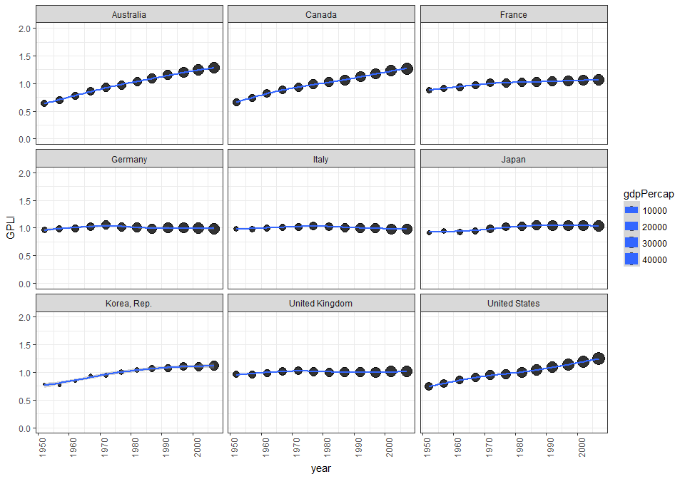

hw03: manipulate & explore data (dplyr, ggplot2)
================
Yeonuk
September 28, 2017

##### Packages which I used

``` r
suppressPackageStartupMessages(library(tidyverse)) 
suppressPackageStartupMessages(library(gapminder))
suppressPackageStartupMessages(library(cowplot))

knitr::opts_chunk$set(fig.width=10, fig.height=7)
```

Report my process
-----------------

> I worked for **4 tasks** (1st, 2nd, 4th, and 6th tasks). I tried my best to analyze Gapminder data set. All the tasks include figures and tables.
>
> *Please enjoy the results!!*

Homework
--------

### Task 1: Get the maximum and minimum of GDP per capita for all continents.

-   See the table and boxplot. You can find not only the Max/Min values but also the country and year for the max/min values.

``` r
# extract max and min of gdpPercap
data10 <- gapminder %>% group_by(continent) %>% 
  summarise(MAX = max(gdpPercap),MIN = min(gdpPercap)) 

# extract country and year which are with max and min of gdpPercap
data11 <- gapminder %>% filter(gdpPercap %in% data10$MAX) %>% 
  mutate(MAX_info = paste(country, year, sep=", ")) %>% 
  select(continent, MAX_info) 
data12 <- gapminder %>% filter(gdpPercap %in% data10$MIN) %>% 
  mutate(MIN_info = paste(country, year, sep=", ")) %>% 
  select(continent, MIN_info)

# rearrange by name of continent (alphabet)
data11 <- arrange(data11, continent) 
data12 <- arrange(data12, continent)

# merge data and make table
Task1 <- data.frame(data10, MAX_info=data11$MAX_info, MIN_info=data12$MIN_info)

rm(data10,data11,data12)
knitr::kable(Task1)
```

| continent |        MAX|         MIN| MAX\_info           | MIN\_info                    |
|:----------|----------:|-----------:|:--------------------|:-----------------------------|
| Africa    |   21951.21|    241.1659| Libya, 1977         | Congo, Dem. Rep., 2002       |
| Americas  |   42951.65|   1201.6372| United States, 2007 | Haiti, 2007                  |
| Asia      |  113523.13|    331.0000| Kuwait, 1957        | Myanmar, 1952                |
| Europe    |   49357.19|    973.5332| Norway, 2007        | Bosnia and Herzegovina, 1952 |
| Oceania   |   34435.37|  10039.5956| Australia, 2007     | Australia, 1952              |

``` r
#drawing boxplot with texts (country, year) on max and min points
Plot1 <- gapminder %>% ggplot(aes(continent, gdpPercap)) +
     geom_boxplot(aes(fill=continent)) +
     geom_text(aes(label=ifelse(gdpPercap %in% c(Task1$MAX,Task1$MIN), 
                                paste(country,year,sep=", \n"),''), angle=5)) +
     scale_y_continuous(limits=c(-10000,120000)) +
     theme_light()+ 
     labs(y="GDP per capita", title="GDP BoxPlot for each continent with max & min info")

Plot1
```


### Task 2: Look at the spread of GDP per capita within the continents.

-   See the table and boxplot. Distributions of GDP per capita for each continent looks interesting. For example, mean value of Africa is most small and at the same time SD also small.

``` r
Task2 <- gapminder %>% group_by(continent) %>% 
                      summarize(MAX = max(gdpPercap), MIN = min(gdpPercap), 
                      MEAN = mean(gdpPercap), SD = sd(gdpPercap), 
                      Q1 = quantile(gdpPercap,probs=0.25), 
                      Q2 = quantile(gdpPercap,probs=0.5),
                      Q3 = quantile(gdpPercap,probs=0.75))
knitr::kable(Task2)  
```

| continent |        MAX|         MIN|       MEAN|         SD|         Q1|         Q2|         Q3|
|:----------|----------:|-----------:|----------:|----------:|----------:|----------:|----------:|
| Africa    |   21951.21|    241.1659|   2193.755|   2827.930|    761.247|   1192.138|   2377.417|
| Americas  |   42951.65|   1201.6372|   7136.110|   6396.764|   3427.779|   5465.510|   7830.210|
| Asia      |  113523.13|    331.0000|   7902.150|  14045.373|   1056.993|   2646.787|   8549.256|
| Europe    |   49357.19|    973.5332|  14469.476|   9355.213|   7213.085|  12081.749|  20461.386|
| Oceania   |   34435.37|  10039.5956|  18621.609|   6358.983|  14141.859|  17983.304|  22214.117|

``` r
Plot2 <- gapminder %>% ggplot(aes(gdpPercap)) 
      
Plot20 <- Plot2 + 
      geom_freqpoly(aes(gdpPercap,..density..,colour=continent), binwidth = 1800) +
      labs(x="GDP per capita", title="GDP histogram for each continent") +theme_bw()
Plot21 <- Plot2 + 
      facet_wrap( ~ continent) + 
      geom_histogram(aes(gdpPercap,..density..), bins =65, colour="blue") +
      labs(x="GDP per capita") +theme_bw()


plot_grid(Plot20, Plot21, ncol = 1, nrow = 2)
```

-1.png)

### Task 4: How is life expectancy changing over time on different continents?

-   See the table and figure. The mean value of life expectancies for each continent have been increased during last 50 years. Most continent except Africa, SD values are decreased meaning lifeExp differences between countries in a continent was reduced. As for Africa, gaps between high lifeExp countries and low lifeExp country have been increased.

``` r
Data4 <- gapminder %>% group_by(continent, year) %>%
  summarise(M = mean(lifeExp), SD = sqrt(var(lifeExp)))

AF <- Data4 %>% filter(continent == "Africa")
AM <- Data4 %>% filter(continent == "Americas")
AS <- Data4 %>% filter(continent == "Asia") 
EU <- Data4 %>% filter(continent == "Europe") 
OC <- Data4 %>% filter(continent == "Oceania") 

Task4 <- cbind(AF,AM,AS,EU,OC)
Task4 <- Task4[-c(1,5,6,9,10,13,14,17,18)]


names(Task4) <- c("year", "AF.mean", "AF.SD", "AM.mean", "AM.SD", 
                  "AS.mean", "AS.SD", "EU.mean", "EU_SD", "OC.mean", "OC.SD")
rm(AF, AM, AS, EU,OC)

Task4 <- round(Task4, digits = 2)

knitr::kable(Task4, )  
```

|  year|  AF.mean|  AF.SD|  AM.mean|  AM.SD|  AS.mean|  AS.SD|  EU.mean|  EU\_SD|  OC.mean|  OC.SD|
|-----:|--------:|------:|--------:|------:|--------:|------:|--------:|-------:|--------:|------:|
|  1952|    39.14|   5.15|    53.28|   9.33|    46.31|   9.29|    64.41|    6.36|    69.25|   0.19|
|  1957|    41.27|   5.62|    55.96|   9.03|    49.32|   9.64|    66.70|    5.30|    70.30|   0.05|
|  1962|    43.32|   5.88|    58.40|   8.50|    51.56|   9.82|    68.54|    4.30|    71.09|   0.22|
|  1967|    45.33|   6.08|    60.41|   7.91|    54.66|   9.65|    69.74|    3.80|    71.31|   0.30|
|  1972|    47.45|   6.42|    62.39|   7.32|    57.32|   9.72|    70.78|    3.24|    71.91|   0.03|
|  1977|    49.58|   6.81|    64.39|   7.07|    59.61|  10.02|    71.94|    3.12|    72.85|   0.90|
|  1982|    51.59|   7.38|    66.23|   6.72|    62.62|   8.54|    72.81|    3.22|    74.29|   0.64|
|  1987|    53.34|   7.86|    68.09|   5.80|    64.85|   8.20|    73.64|    3.17|    75.32|   1.41|
|  1992|    53.63|   9.46|    69.57|   5.17|    66.54|   8.08|    74.44|    3.21|    76.94|   0.87|
|  1997|    53.60|   9.10|    71.15|   4.89|    68.02|   8.09|    75.51|    3.10|    78.19|   0.91|
|  2002|    53.33|   9.59|    72.42|   4.80|    69.23|   8.37|    76.70|    2.92|    79.74|   0.89|
|  2007|    54.81|   9.63|    73.61|   4.44|    70.73|   7.96|    77.65|    2.98|    80.72|   0.73|

``` r
Plot40 <- ggplot(Data4, aes(year,M,colour=continent)) +
    geom_errorbar(aes(ymin=M-SD/2, ymax=M+SD/2), colour="black", width=1, alpha=0.8) +
    geom_line() +
    geom_point() +
    labs(y="Annual mean for Life Exp with SD") +theme_bw()

Plot41 <- gapminder %>% ggplot(aes(x=year,y=lifeExp, colour=continent)) +
  geom_boxplot(aes(group = year)) +
  facet_grid(continent ~.) +
  labs(y="boxplot for Life Exp") +theme_bw()

plot_grid(Plot40, Plot41, ncol = 1, nrow = 2)
```

-1.png)

### Task 6: Find countries with interesting stories: 11 countries which are G20 and also OECD member with high GDP.

-   I would like to find some relationships between life expectancy and population. So, I made an index (GPLI, see the below code). Interesting thing is that GPLI value is stable except Australia, Canada, and America where immigration rates are high. In other words, I can infer that increase in population in these three countries have not been affected by health tech but by immigration.

``` r
Data6 <- gapminder %>% 
  filter(country %in% c('Australia',  'Canada', 'France', 'Germany',   'Italy', 'Japan', 
                        'Korea, Rep.',  'United Kingdom', 'United States')) %>%
  group_by(country) %>%
  mutate(Npop = pop/mean(pop), 
         NlifeExp = lifeExp/mean(lifeExp)) %>% #Normalizing the changes by dividing mean changes
  mutate(GPLI = Npop/NlifeExp)     # GPLI = Gapminder Population LifeExp index (I just made for this homework.)

Data6 %>% ggplot(aes(year,GPLI,size=gdpPercap)) + 
  geom_point(alpha=0.8) +geom_smooth() +
  facet_wrap(~ country)  + ylim(0,2) +theme_bw() + theme(axis.text.x = element_text(angle=90)) 
```

    ## `geom_smooth()` using method = 'loess'


