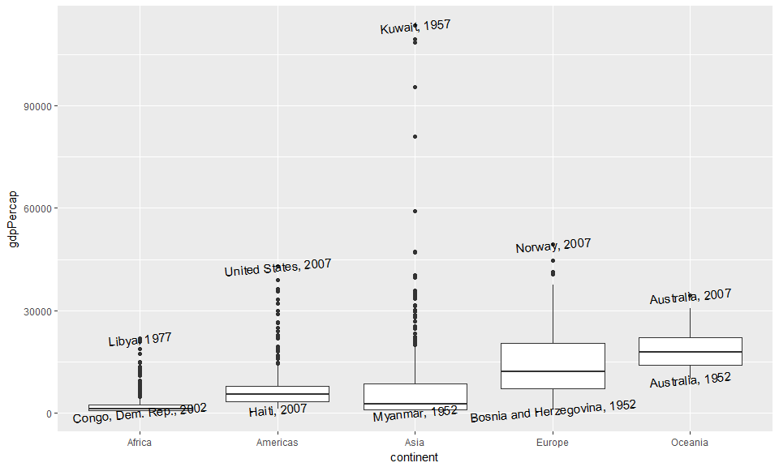

hw03: manipulate & explore data (dplyr, ggplot2)
================
Yeonuk
September 28, 2017

##### Packages which I used

``` r
suppressPackageStartupMessages(library(tidyverse)) 
suppressPackageStartupMessages(library(gapminder))

knitr::opts_chunk$set(fig.width=10, fig.height=6)
```

Report my process
-----------------

> I worked for **4 tasks** (1st, 2nd, 4th, and 6th tasks). I tried my best to analyze Gapminder data set. All the tasks include figures and tables.
>
> *Please enjoy the results!!*

Homework
--------

### Task 1: Get the maximum and minimum of GDP per capita for all continents.

-   See the table and boxplot.

``` r
T10 <- gapminder %>% group_by(continent) %>% 
  summarise(MAX = max(gdpPercap),MIN = min(gdpPercap))
T11 <- gapminder %>% filter(gdpPercap %in% T10$MAX) %>% 
  mutate(MAX_info = paste(country, year, sep=", ")) %>% select(MAX_info)
T12 <- gapminder %>% filter(gdpPercap %in% T10$MIN) %>% 
  mutate(MIN_info = paste(country, year, sep=", ")) %>% select(MIN_info)
T1 <- data.frame(T10, T11, T12)

knitr::kable(T1)  
```

| continent |        MAX|         MIN| MAX\_info           | MIN\_info                    |
|:----------|----------:|-----------:|:--------------------|:-----------------------------|
| Africa    |   21951.21|    241.1659| Australia, 2007     | Australia, 1952              |
| Americas  |   42951.65|   1201.6372| Kuwait, 1957        | Bosnia and Herzegovina, 1952 |
| Asia      |  113523.13|    331.0000| Libya, 1977         | Congo, Dem. Rep., 2002       |
| Europe    |   49357.19|    973.5332| Norway, 2007        | Haiti, 2007                  |
| Oceania   |   34435.37|  10039.5956| United States, 2007 | Myanmar, 1952                |

``` r
P1 <- gapminder %>% ggplot(aes(continent, gdpPercap))
P1 + geom_boxplot() +
     geom_text(aes(label=ifelse(gdpPercap %in% c(T1$MAX,T1$MIN), 
                                paste(country,year,sep=", "),''), angle=5))
```



### Task 2: Look at the spread of GDP per capita within the continents.

### Task 4: How is life expectancy changing over time on different continents?

### Task 6: Find countries with interesting stories. Open-ended and, therefore, hard.
