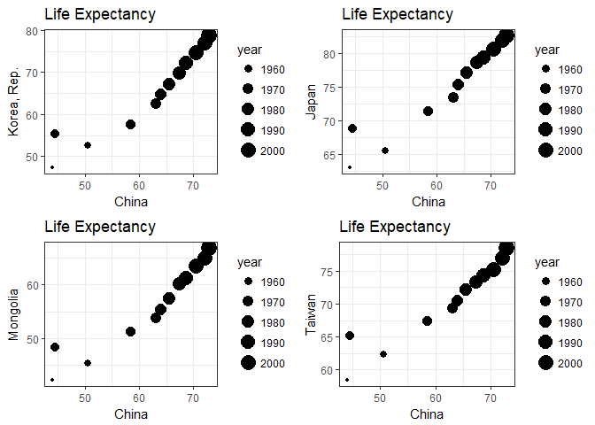

hw04\_yeonuk
================

Package info: I used *tidyverse*, *gapminder*, and *cowplot* (cowplot for plot layout).

    ## Warning: package 'dplyr' was built under R version 3.4.2

    ## Warning: package 'cowplot' was built under R version 3.4.2

1. General data reshaping and relationship to aggregation
---------------------------------------------------------

### My choice: Activity \#2

### 1.1. Make a table

-   Make a tibble with one row per year and columns for life expectancy for two or more countries.
-   Use *knitr::kable()* to make this table look pretty in your rendered homework.

``` r
new_lifeExp <- gapminder %>%
  filter(country %in% c("China", "Korea, Rep.","Japan","Mongolia", "Taiwan")) %>%
  select(country, year, lifeExp) %>% 
  group_by(year) %>% 
  spread(key=country, value=lifeExp)
knitr::kable(new_lifeExp)
```

|  year|     China|   Japan|  Korea, Rep.|  Mongolia|  Taiwan|
|-----:|---------:|-------:|------------:|---------:|-------:|
|  1952|  44.00000|  63.030|       47.453|    42.244|   58.50|
|  1957|  50.54896|  65.500|       52.681|    45.248|   62.40|
|  1962|  44.50136|  68.730|       55.292|    48.251|   65.20|
|  1967|  58.38112|  71.430|       57.716|    51.253|   67.50|
|  1972|  63.11888|  73.420|       62.612|    53.754|   69.39|
|  1977|  63.96736|  75.380|       64.766|    55.491|   70.59|
|  1982|  65.52500|  77.110|       67.123|    57.489|   72.16|
|  1987|  67.27400|  78.670|       69.810|    60.222|   73.40|
|  1992|  68.69000|  79.360|       72.244|    61.271|   74.26|
|  1997|  70.42600|  80.690|       74.647|    63.625|   75.25|
|  2002|  72.02800|  82.000|       77.045|    65.033|   76.99|
|  2007|  72.96100|  82.603|       78.623|    66.803|   78.40|

### 1.2. Make a figure

-   Take advantage of this new data shape to scatterplot life expectancy for one country against that of another.

``` r
P1 <- new_lifeExp %>% ggplot(aes(x = China, y=`Korea, Rep.`, size = year)) + 
  geom_point() + ggtitle("Life Expectancy") + theme_bw()
P2 <- new_lifeExp %>% ggplot(aes(x = China, y=Japan, size = year)) + 
  geom_point() + ggtitle("Life Expectancy") + theme_bw()
P3 <- new_lifeExp %>% ggplot(aes(x = China, y=Mongolia, size = year)) + 
  geom_point() + ggtitle("Life Expectancy") + theme_bw()
P4 <- new_lifeExp %>% ggplot(aes(x = China, y=Taiwan, size = year)) + 
  geom_point() + ggtitle("Life Expectancy") + theme_bw()

plot_grid(P1,P2,P3,P4, ncol = 2, nrow = 2, label_size = 8)
```



##### Reflection

I compared countries in EastAsia. The table column by each country looks useful when we compare time series variables. This table is also useful when making a scatter plot.

2. Join, merge, look up
-----------------------

### My choice: Activity \#1

Create a second data frame, complementary to Gapminder

-   Complementary variables: languages, G20, OECD
-   Countries: "China", "Korea, Rep.","Japan","Mongolia", "Taiwan", "Canada", "Argentina"
-   Overlaped variables with gapminder: country, continent

``` r
# making a data frame
country <- c("China", "Korea, Rep.","Japan","Mongolia", "Taiwan", "Canada", "Argentina")
continent <- c("Asia","Asia","Asia","Asia","Asia","Americas","Americas")
languages <- c("Mandarin","Korean","Japanese","Mandarin","Mandarin", "English", "Spanish")
G20 <- c(1,1,1,0,0,1,1) # 1: in G20, 0: not in G20
OECD <- c(0,1,1,0,0,1,0) # 1: in OECD, 0: not in OECD

complementary <- data.frame(country, continent, languages, G20, OECD)

knitr::kable(complementary)
```

| country     | continent | languages |  G20|  OECD|
|:------------|:----------|:----------|----:|-----:|
| China       | Asia      | Mandarin  |    1|     0|
| Korea, Rep. | Asia      | Korean    |    1|     1|
| Japan       | Asia      | Japanese  |    1|     1|
| Mongolia    | Asia      | Mandarin  |    0|     0|
| Taiwan      | Asia      | Mandarin  |    0|     0|
| Canada      | Americas  | English   |    1|     1|
| Argentina   | Americas  | Spanish   |    1|     0|

``` r
# Making a subset of gapminder in order to use join with small data frame
gapminder_Asia2007 <- gapminder %>% 
  filter(continent == "Asia" & year == 2007 & lifeExp >=65) %>%
  select(country, continent, gdpPercap, lifeExp, pop)

knitr::kable(gapminder_Asia2007)
```

| country            | continent |  gdpPercap|  lifeExp|         pop|
|:-------------------|:----------|----------:|--------:|-----------:|
| Bahrain            | Asia      |  29796.048|   75.635|      708573|
| China              | Asia      |   4959.115|   72.961|  1318683096|
| Hong Kong, China   | Asia      |  39724.979|   82.208|     6980412|
| Indonesia          | Asia      |   3540.652|   70.650|   223547000|
| Iran               | Asia      |  11605.714|   70.964|    69453570|
| Israel             | Asia      |  25523.277|   80.745|     6426679|
| Japan              | Asia      |  31656.068|   82.603|   127467972|
| Jordan             | Asia      |   4519.461|   72.535|     6053193|
| Korea, Dem. Rep.   | Asia      |   1593.065|   67.297|    23301725|
| Korea, Rep.        | Asia      |  23348.140|   78.623|    49044790|
| Kuwait             | Asia      |  47306.990|   77.588|     2505559|
| Lebanon            | Asia      |  10461.059|   71.993|     3921278|
| Malaysia           | Asia      |  12451.656|   74.241|    24821286|
| Mongolia           | Asia      |   3095.772|   66.803|     2874127|
| Oman               | Asia      |  22316.193|   75.640|     3204897|
| Pakistan           | Asia      |   2605.948|   65.483|   169270617|
| Philippines        | Asia      |   3190.481|   71.688|    91077287|
| Saudi Arabia       | Asia      |  21654.832|   72.777|    27601038|
| Singapore          | Asia      |  47143.180|   79.972|     4553009|
| Sri Lanka          | Asia      |   3970.095|   72.396|    20378239|
| Syria              | Asia      |   4184.548|   74.143|    19314747|
| Taiwan             | Asia      |  28718.277|   78.400|    23174294|
| Thailand           | Asia      |   7458.396|   70.616|    65068149|
| Vietnam            | Asia      |   2441.576|   74.249|    85262356|
| West Bank and Gaza | Asia      |   3025.350|   73.422|     4018332|

### 2.1. Using left join1

``` r
left <- left_join(complementary, gapminder_Asia2007, by="country")
```

    ## Warning: Column `country` joining factors with different levels, coercing
    ## to character vector

``` r
knitr::kable(left)
```

| country     | continent.x | languages |  G20|  OECD| continent.y |  gdpPercap|  lifeExp|         pop|
|:------------|:------------|:----------|----:|-----:|:------------|----------:|--------:|-----------:|
| China       | Asia        | Mandarin  |    1|     0| Asia        |   4959.115|   72.961|  1318683096|
| Korea, Rep. | Asia        | Korean    |    1|     1| Asia        |  23348.140|   78.623|    49044790|
| Japan       | Asia        | Japanese  |    1|     1| Asia        |  31656.068|   82.603|   127467972|
| Mongolia    | Asia        | Mandarin  |    0|     0| Asia        |   3095.772|   66.803|     2874127|
| Taiwan      | Asia        | Mandarin  |    0|     0| Asia        |  28718.277|   78.400|    23174294|
| Canada      | Americas    | English   |    1|     1| NA          |         NA|       NA|          NA|
| Argentina   | Americas    | Spanish   |    1|     0| NA          |         NA|       NA|          NA|

##### Reflection

Data in *gapminder\_Asia2007* get into *complementary*. One problem is there are two continent columns (continent.x, continent.y) in the new dataset.

### 2.2. Using left join2

``` r
left2 <- left_join(complementary, gapminder_Asia2007, by=c("country", "continent"))
```

    ## Warning: Column `country` joining factors with different levels, coercing
    ## to character vector

    ## Warning: Column `continent` joining factors with different levels, coercing
    ## to character vector

``` r
knitr::kable(left2)
```

| country     | continent | languages |  G20|  OECD|  gdpPercap|  lifeExp|         pop|
|:------------|:----------|:----------|----:|-----:|----------:|--------:|-----------:|
| China       | Asia      | Mandarin  |    1|     0|   4959.115|   72.961|  1318683096|
| Korea, Rep. | Asia      | Korean    |    1|     1|  23348.140|   78.623|    49044790|
| Japan       | Asia      | Japanese  |    1|     1|  31656.068|   82.603|   127467972|
| Mongolia    | Asia      | Mandarin  |    0|     0|   3095.772|   66.803|     2874127|
| Taiwan      | Asia      | Mandarin  |    0|     0|  28718.277|   78.400|    23174294|
| Canada      | Americas  | English   |    1|     1|         NA|       NA|          NA|
| Argentina   | Americas  | Spanish   |    1|     0|         NA|       NA|          NA|

##### Reflection

Using *continent* as well as *country* for left join can fix the problem of the first table.

### 2.3. Using inner join

``` r
inner <- inner_join(gapminder_Asia2007, complementary, by="country")
```

    ## Warning: Column `country` joining factors with different levels, coercing
    ## to character vector

``` r
knitr::kable(inner)
```

| country     | continent.x |  gdpPercap|  lifeExp|         pop| continent.y | languages |  G20|  OECD|
|:------------|:------------|----------:|--------:|-----------:|:------------|:----------|----:|-----:|
| China       | Asia        |   4959.115|   72.961|  1318683096| Asia        | Mandarin  |    1|     0|
| Japan       | Asia        |  31656.068|   82.603|   127467972| Asia        | Japanese  |    1|     1|
| Korea, Rep. | Asia        |  23348.140|   78.623|    49044790| Asia        | Korean    |    1|     1|
| Mongolia    | Asia        |   3095.772|   66.803|     2874127| Asia        | Mandarin  |    0|     0|
| Taiwan      | Asia        |  28718.277|   78.400|    23174294| Asia        | Mandarin  |    0|     0|

##### Reflection

You can see there is no data for *Canada* and *Argentina* since I used inner join. The dataset *gapminder\_Asia2007* does not include the countries in Americas.

### 2.4. Using anti join

``` r
anti <- anti_join(complementary, gapminder_Asia2007, by="country")
```

    ## Warning: Column `country` joining factors with different levels, coercing
    ## to character vector

``` r
knitr::kable(anti)
```

| country   | continent | languages |  G20|  OECD|
|:----------|:----------|:----------|----:|-----:|
| Canada    | Americas  | English   |    1|     1|
| Argentina | Americas  | Spanish   |    1|     0|

##### Reflection

By using anti join, you can find *Canada* and *Argentina*.

### 2.5. Using full join

``` r
full <- full_join(complementary, gapminder_Asia2007, by=c("country","continent"))
```

    ## Warning: Column `country` joining factors with different levels, coercing
    ## to character vector

    ## Warning: Column `continent` joining factors with different levels, coercing
    ## to character vector

``` r
full <- arrange(full, continent)
knitr::kable(full)
```

| country            | continent | languages |  G20|  OECD|  gdpPercap|  lifeExp|         pop|
|:-------------------|:----------|:----------|----:|-----:|----------:|--------:|-----------:|
| Canada             | Americas  | English   |    1|     1|         NA|       NA|          NA|
| Argentina          | Americas  | Spanish   |    1|     0|         NA|       NA|          NA|
| China              | Asia      | Mandarin  |    1|     0|   4959.115|   72.961|  1318683096|
| Korea, Rep.        | Asia      | Korean    |    1|     1|  23348.140|   78.623|    49044790|
| Japan              | Asia      | Japanese  |    1|     1|  31656.068|   82.603|   127467972|
| Mongolia           | Asia      | Mandarin  |    0|     0|   3095.772|   66.803|     2874127|
| Taiwan             | Asia      | Mandarin  |    0|     0|  28718.277|   78.400|    23174294|
| Bahrain            | Asia      | NA        |   NA|    NA|  29796.048|   75.635|      708573|
| Hong Kong, China   | Asia      | NA        |   NA|    NA|  39724.979|   82.208|     6980412|
| Indonesia          | Asia      | NA        |   NA|    NA|   3540.652|   70.650|   223547000|
| Iran               | Asia      | NA        |   NA|    NA|  11605.714|   70.964|    69453570|
| Israel             | Asia      | NA        |   NA|    NA|  25523.277|   80.745|     6426679|
| Jordan             | Asia      | NA        |   NA|    NA|   4519.461|   72.535|     6053193|
| Korea, Dem. Rep.   | Asia      | NA        |   NA|    NA|   1593.065|   67.297|    23301725|
| Kuwait             | Asia      | NA        |   NA|    NA|  47306.990|   77.588|     2505559|
| Lebanon            | Asia      | NA        |   NA|    NA|  10461.059|   71.993|     3921278|
| Malaysia           | Asia      | NA        |   NA|    NA|  12451.656|   74.241|    24821286|
| Oman               | Asia      | NA        |   NA|    NA|  22316.193|   75.640|     3204897|
| Pakistan           | Asia      | NA        |   NA|    NA|   2605.948|   65.483|   169270617|
| Philippines        | Asia      | NA        |   NA|    NA|   3190.481|   71.688|    91077287|
| Saudi Arabia       | Asia      | NA        |   NA|    NA|  21654.832|   72.777|    27601038|
| Singapore          | Asia      | NA        |   NA|    NA|  47143.180|   79.972|     4553009|
| Sri Lanka          | Asia      | NA        |   NA|    NA|   3970.095|   72.396|    20378239|
| Syria              | Asia      | NA        |   NA|    NA|   4184.548|   74.143|    19314747|
| Thailand           | Asia      | NA        |   NA|    NA|   7458.396|   70.616|    65068149|
| Vietnam            | Asia      | NA        |   NA|    NA|   2441.576|   74.249|    85262356|
| West Bank and Gaza | Asia      | NA        |   NA|    NA|   3025.350|   73.422|     4018332|

##### Reflection

Finally, I used full join. You can see the union between the two datasets.
