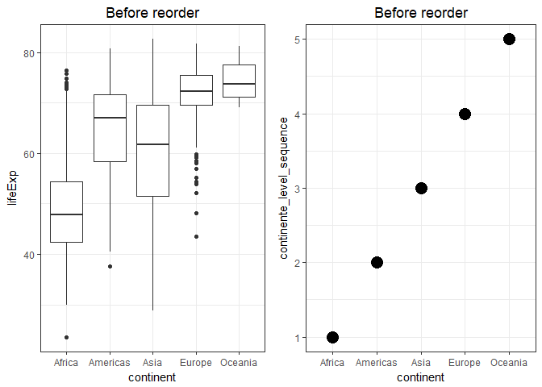
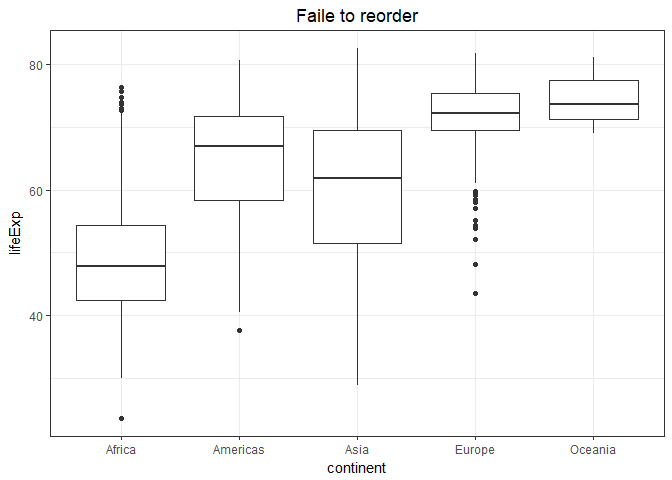
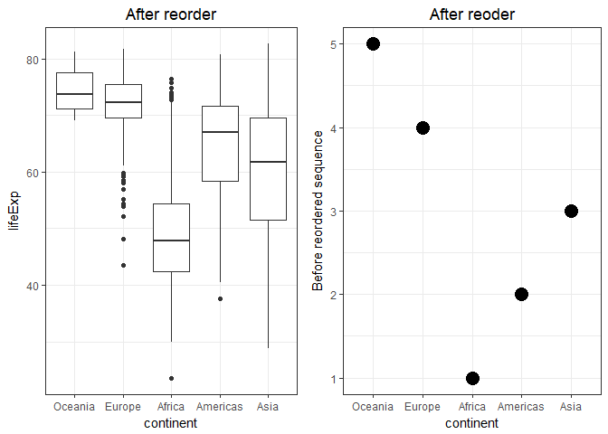
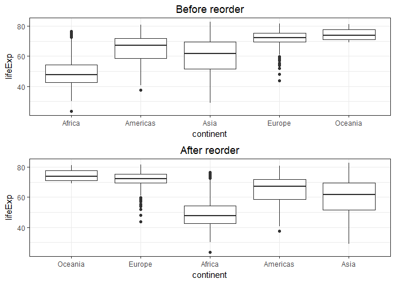
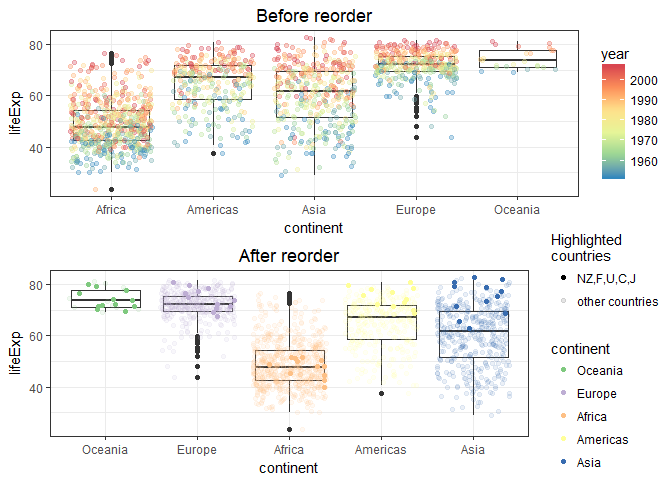

hw05\_yeonuk
================
yeonuk
Oct 20, 2017

### load package

Package info: I used *gapminder* for this homework.

``` r
suppressPackageStartupMessages(library(tidyverse)) 
suppressPackageStartupMessages(library(dplyr))
suppressPackageStartupMessages(library(gapminder))
suppressPackageStartupMessages(library(cowplot))
suppressPackageStartupMessages(library(forcats))
```

Factor management
-----------------

### 1. Drop Oceania

1.1. Check information before removing Oceania

``` r
# Check the class of continent
class(gapminder$continent)
```

    ## [1] "factor"

``` r
# The Number of Levels of a Factor
nlevels(gapminder$continent)
```

    ## [1] 5

``` r
# Summary of continent
summary(gapminder$continent) 
```

    ##   Africa Americas     Asia   Europe  Oceania 
    ##      624      300      396      360       24

The continent column is a facor as you can see above and there are **5 levels** of such factor. Also, you can see there are 24 rows for Oceania. Let me remove them.

1.2. Remove data

``` r
# Remove data including Oceania in the continent column
new_gapminder <- gapminder %>% 
  filter(continent != "Oceania") 

# The Number of Levels of a Factor
nlevels(new_gapminder$continent)
```

    ## [1] 5

``` r
# Summary of continent
summary(new_gapminder$continent) 
```

    ##   Africa Americas     Asia   Europe  Oceania 
    ##      624      300      396      360        0

Rows which include Oceania was removed as the summary table. However, The number of levels of the factor continent is still 5. This is because the Oceania level is not removed. Let me try to remove the level.

1.3. Remove the Oceania level

``` r
# Remove the level
new_gapminder <- droplevels(new_gapminder)

# The Number of Levels of a Factor
nlevels(new_gapminder$continent)
```

    ## [1] 4

``` r
# Summary of continent
summary(new_gapminder$continent) 
```

    ##   Africa Americas     Asia   Europe 
    ##      624      300      396      360

We can remove the level by using *droplevels* in the *forcats* package. You can see the result that the number of levels is 4 and there are not Oceania level in the summary table.

### 2. Reorder the levels of continent

2.1. Explore how continent arranged

``` r
p1 <- gapminder %>% ggplot(aes(x=continent,y=lifeExp)) +
  geom_boxplot() + theme_bw() +
  ggtitle("Before reorder") +
  theme(plot.title = element_text(hjust = 0.5))

new_gapminder <- gapminder %>% 
  mutate(continente_level_sequence=as.numeric(continent))

p2 <- new_gapminder %>%  ggplot(aes(x=continent, y =continente_level_sequence)) + 
  geom_point(size=5) + theme_bw() +
  ggtitle("Before reorder") +
  theme(plot.title = element_text(hjust = 0.5))

plot_grid(p1,p2) #from cowplot
```



We can find in the first figure that the x-axis is automatically arraged by the first alphabet of continent. The reason is that the sequence of the continent is based on the sequence of the alphabet (see the second figure). My intention is change this sequence.

I would like to change the sequence by the variance of lifeExp.

2.2. export and import a file using *write\_csv()* and *read\_csv* (This is for **File I/O**)

``` r
# make new data
lifeExp_variance_continent<- gapminder %>%
  group_by(continent) %>%
  summarise(v_lifeExp = var(lifeExp)) %>%
  arrange(v_lifeExp)

#write the new data
path <- "C:/Users/yeonuk/Documents/R/STAT545-hw-Kim-Yeonuk/hw05"
write_csv(lifeExp_variance_continent, file.path(path,"lifeExp_variance_continent.csv"))

#import the new data
reference <- read_csv("lifeExp_variance_continent.csv")
```

    ## Parsed with column specification:
    ## cols(
    ##   continent = col_character(),
    ##   v_lifeExp = col_double()
    ## )

``` r
reference$continent <- as.factor(reference$continent)


knitr::kable(reference)
```

| continent |  v\_lifeExp|
|:----------|-----------:|
| Oceania   |    14.40666|
| Europe    |    29.51942|
| Africa    |    83.72635|
| Americas  |    87.33067|
| Asia      |   140.76711|

By using the *reference* which includes the variance of lifeExp, I will reorder the level of continent.

2.3. arrange by variance of lifeExp

``` r
# add the v_lifeExp column to gapminder from the reference 
new3_gapminder <- left_join(new_gapminder, reference, by = "continent")

# arrange by v_lifeExp
new3_gapminder <- arrange(new3_gapminder,v_lifeExp)

new3_gapminder %>% ggplot(aes(x=continent,y=lifeExp)) +
  geom_boxplot()+ theme_bw() +
  ggtitle("Faile to reorder") +
  theme(plot.title = element_text(hjust = 0.5))
```



I arranged new3\_gapminder by the sequence of variance. However, when I made a figure with continent axis, the effect of arrange cannot be found. This figure is exactly same with the first figure.

2.4. Reordering by using *fct\_inorder*

``` r
# arrange by v_lifeExp
new3_gapminder <- arrange(new3_gapminder,v_lifeExp)

# reorder the continent
new3_gapminder$continent<-fct_inorder(new3_gapminder$continent)

p3 <- new3_gapminder %>% ggplot(aes(x=continent,y=lifeExp)) +
  geom_boxplot() + theme_bw() +
  ggtitle("After reorder") +
  theme(plot.title = element_text(hjust = 0.5))

p4 <- new3_gapminder %>% 
  ggplot(aes(x=continent, y =continente_level_sequence)) + 
  geom_point(size=5) + theme_bw() +
  ggtitle("After reoder") +
  ylab("Before reordered sequence") +
  theme(plot.title = element_text(hjust = 0.5))

plot_grid(p3,p4) #from cowplot
```



You can check the difference between previous figures and these two figures. By using both *arrange()* and *fct\_inorder*, I can reorder the levels of continent.

Visualization design & Writing figures to file
----------------------------------------------

3.1. before editted

``` r
plot_grid(p1,p3,ncol=1)
```



3.2. Editted version

``` r
# first one: jitter and colour by year

p1 <- p1 +
  geom_jitter(aes(colour=year), alpha= 0.3) +
  scale_colour_distiller(palette="Spectral")


# second one: jitter and colour by continent with highlight some countries
p3 <- p3 + 
  geom_jitter(aes(color=continent, 
                  alpha=country %in% c("New Zealand","France", 
                                       "Uganda","Canada","Japan"))) + 
  scale_alpha_discrete(name="Highlighted\ncountries",
                         breaks=c(TRUE,FALSE),
                         labels=c("NZ,F,U,C,J", "other countries")) +
  scale_colour_brewer(palette="Accent")


plot_grid(p1,p3,ncol=1)
```



jitter point with box plot looks awesome. The highligthed countries are New Zealand, France, Uganda, Canada and Japan.

3.3. Save figures by using ggsave in different formats

``` r
# Vector format
ggsave("lifeExp.pdf", plot = plot_grid(p1,p3,ncol=1), width = 10, height = 8) 
# Raster format
ggsave("lifeExp.png", plot = plot_grid(p1,p3,ncol=1), width = 10, height = 8, dpi = 500) 
```

But I want to do more!
----------------------

``` r
do_more_gapminder <- gapminder %>% 
  filter(country %in% c("Mexico","Spain","Portugal","Brazil") & year == 1952) %>%
  droplevels()

do_more_gapminder$country <- fct_recode(do_more_gapminder$country, 
                                       Spanish = "Mexico", Spanish = "Spain", 
                                       Portuguese = "Portugal", Portuguese = "Brazil")

levels(do_more_gapminder$country)
```

    ## [1] "Portuguese" "Spanish"

The new level for the 4 countries which I used is language. You can see that the level of country is chaged to Portuguese and Spanish. This can be possible by using *fct\_recode*.
