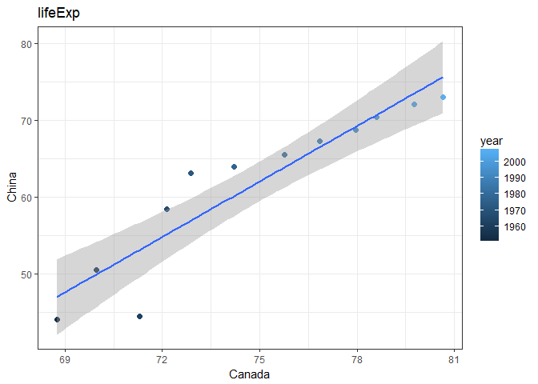
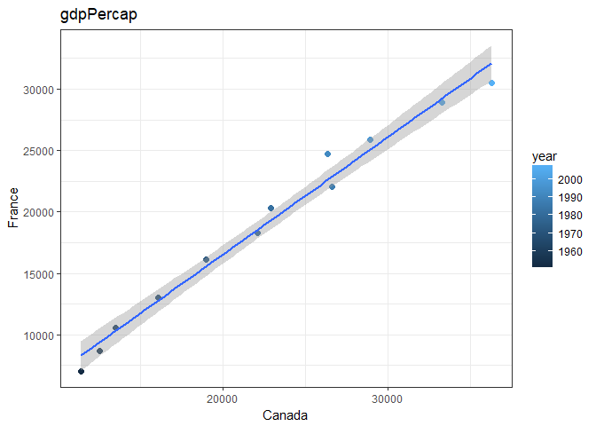

hw06\_yeonuk
================
yeonuk
Nov 04, 2017

### What I did

-   Guideline: Pick (at least) two of the six (numbered) topics below and do one of the exercise prompts listed, or something comparable using your dataset of choice.
-   I've work for **2. Writing functions, 4. Work with the singer data, 6. Work with a nested data frame**

### load package

``` r
suppressPackageStartupMessages(library(tidyverse)) 
suppressPackageStartupMessages(library(gapminder))
```

Writing functions
-----------------

-   Write one function that do something useful to pieces of the Gapminder.
-   The new function name is *compare\_countries*.
-   As you know the gapminder dataset is not column by each country, so it is hard to compare each country without using *spread*. This new function can help you to compare any variable in gapminder dataset between two countries. The output includes a figure and linear regression info. Also, I added a warning message.

``` r
compare_countries <- function(data=gapminder, x, y, variable = gdpPercap){
  
  # check the input data
  if( !(x %in% data$country) | !(y %in% data$country)  ) {
  stop('I am so sorry, but this function only works for countries in gapminder!\n')
  } else if( !(variable %in% colnames(gapminder)) ){
  stop('I am so sorry, but this function only works for variables in gapminder!\n')  
  }
  
  # preparation to compare two countries using spread 
  use <- data %>%
  filter(country %in% c(x, y)) %>%
  select(country, year, variable) %>% 
  group_by(year) %>% 
  spread(key=country, value=variable)
  
  # plot (FYI: eval(parse(text = x)) for changing string to variable name)
  p <- use %>% ggplot(aes(eval(parse(text = x)), eval(parse(text = y)), colour = year)) + 
      geom_point(size=2) + ggtitle(variable) + 
      xlab(x) + ylab(y) + theme_bw() +
      geom_smooth(method = "lm")
  print(p)
  
  # linear regression
  the_fit <- lm(eval(parse(text = y)) ~ eval(parse(text = x)), use)
  coefs <- coef(the_fit)
  coefs <- as.vector(coefs)
  r_squered <- summary(the_fit)$r.squared
  answer <- c(coefs, r_squered )
  final <- setNames(answer , c("intercept", "slope","r_squred"))
  return(final)
}
```

### test function 1: compare life Expectancy between Canada and China

``` r
compare_countries(data=gapminder, x = 'Canada', y = 'China', variable='lifeExp')
```



    ##    intercept        slope     r_squred 
    ## -118.4610159    2.4064024    0.8612167

### test function 2: compare GDP per cap between Canada and France

``` r
compare_countries(data=gapminder, x = 'Canada', y = 'France', variable='gdpPercap')
```



    ##     intercept         slope      r_squred 
    ## -2548.4376075     0.9540962     0.9823650

I've tested wrong input as below figure,
