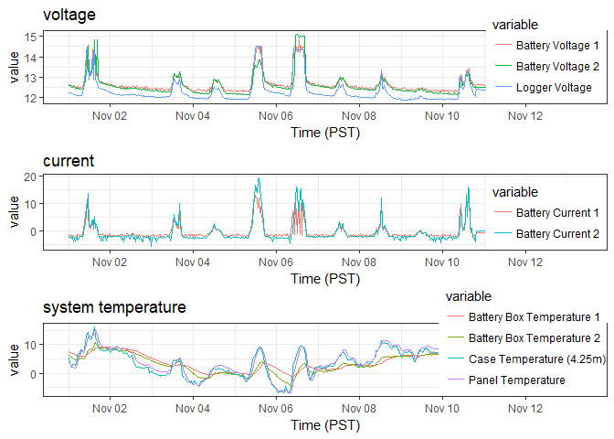

01\_pre\_analysis
================
Yeonuk
November 13, 2017

Load library
------------

``` r
suppressPackageStartupMessages(library(tidyverse))
```

    ## Warning: package 'readr' was built under R version 3.4.2

``` r
suppressPackageStartupMessages(library(cowplot))
suppressPackageStartupMessages(library(lubridate))
```

Read the output of the first script
-----------------------------------

``` r
system_temp <- read_csv('system_temp.csv')
```

    ## Parsed with column specification:
    ## cols(
    ##   `Time (PST)` = col_datetime(format = ""),
    ##   `Panel Temperature` = col_double(),
    ##   `Battery Box Temperature 1` = col_double(),
    ##   `Battery Box Temperature 2` = col_double(),
    ##   `Case Temperature (4.25m)` = col_double()
    ## )

``` r
current <- read_csv('current.csv')
```

    ## Parsed with column specification:
    ## cols(
    ##   `Time (PST)` = col_datetime(format = ""),
    ##   `Battery Current 1` = col_double(),
    ##   `Battery Current 2` = col_double()
    ## )

``` r
voltage <- read_csv('voltage.csv')
```

    ## Parsed with column specification:
    ## cols(
    ##   `Time (PST)` = col_datetime(format = ""),
    ##   `Logger Voltage` = col_double(),
    ##   `Battery Voltage 1` = col_double(),
    ##   `Battery Voltage 2` = col_double()
    ## )

``` r
knitr::kable(head(system_temp))
```

| Time (PST)          |  Panel Temperature|  Battery Box Temperature 1|  Battery Box Temperature 2|  Case Temperature (4.25m)|
|:--------------------|------------------:|--------------------------:|--------------------------:|-------------------------:|
| 2014-07-09 09:30:00 |              21.69|                        NaN|                        NaN|                       NaN|
| 2014-07-09 10:00:00 |              22.61|                        NaN|                        NaN|                       NaN|
| 2014-07-09 10:30:00 |              23.31|                        NaN|                        NaN|                       NaN|
| 2014-07-09 11:00:00 |              23.44|                        NaN|                        NaN|                       NaN|
| 2014-07-09 11:30:00 |              23.19|                        NaN|                        NaN|                       NaN|
| 2014-07-09 12:00:00 |              22.63|                        NaN|                        NaN|                       NaN|

``` r
knitr::kable(head(current))
```

| Time (PST)          |  Battery Current 1|  Battery Current 2|
|:--------------------|------------------:|------------------:|
| 2015-04-10 16:30:00 |               0.66|                NaN|
| 2015-04-10 17:00:00 |               0.01|                NaN|
| 2015-04-10 17:30:00 |               0.37|                NaN|
| 2015-04-10 18:00:00 |              -0.38|                NaN|
| 2015-04-10 18:30:00 |              -0.68|                NaN|
| 2015-04-10 19:00:00 |              -0.68|                NaN|

``` r
knitr::kable(head(voltage))
```

| Time (PST)          |  Logger Voltage|  Battery Voltage 1|  Battery Voltage 2|
|:--------------------|---------------:|------------------:|------------------:|
| 2014-07-09 09:30:00 |           13.60|                NaN|                NaN|
| 2014-07-09 10:00:00 |           13.60|                NaN|                NaN|
| 2014-07-09 10:30:00 |           13.60|                NaN|                NaN|
| 2014-07-09 11:00:00 |           13.59|                NaN|                NaN|
| 2014-07-09 11:30:00 |           13.60|                NaN|                NaN|
| 2014-07-09 12:00:00 |           13.59|                NaN|                NaN|

Join
----

``` r
merged_data <- inner_join(voltage,current,by='Time (PST)')
merged_data <- inner_join(merged_data,system_temp,by='Time (PST)')

knitr::kable(head(merged_data))
```

| Time (PST)          |  Logger Voltage|  Battery Voltage 1|  Battery Voltage 2|  Battery Current 1|  Battery Current 2|  Panel Temperature|  Battery Box Temperature 1|  Battery Box Temperature 2|  Case Temperature (4.25m)|
|:--------------------|---------------:|------------------:|------------------:|------------------:|------------------:|------------------:|--------------------------:|--------------------------:|-------------------------:|
| 2015-04-10 16:30:00 |           13.87|                NaN|                NaN|               0.66|                NaN|              13.32|                      11.62|                        NaN|                     11.57|
| 2015-04-10 17:00:00 |           13.24|                NaN|                NaN|               0.01|                NaN|              13.06|                      11.76|                        NaN|                      9.82|
| 2015-04-10 17:30:00 |           13.19|                NaN|                NaN|               0.37|                NaN|              11.82|                      11.74|                        NaN|                      9.03|
| 2015-04-10 18:00:00 |           13.00|                NaN|                NaN|              -0.38|                NaN|              10.86|                      11.67|                        NaN|                      7.99|
| 2015-04-10 18:30:00 |           12.85|                NaN|                NaN|              -0.68|                NaN|              10.09|                      11.61|                        NaN|                      7.61|
| 2015-04-10 19:00:00 |           12.80|                NaN|                NaN|              -0.68|                NaN|               9.55|                      11.54|                        NaN|                      7.37|

``` r
knitr::kable(tail(merged_data))
```

| Time (PST)          |  Logger Voltage|  Battery Voltage 1|  Battery Voltage 2|  Battery Current 1|  Battery Current 2|  Panel Temperature|  Battery Box Temperature 1|  Battery Box Temperature 2|  Case Temperature (4.25m)|
|:--------------------|---------------:|------------------:|------------------:|------------------:|------------------:|------------------:|--------------------------:|--------------------------:|-------------------------:|
| 2017-11-13 05:30:00 |           12.20|              12.45|              12.44|              -0.68|              -0.34|               9.53|                       7.80|                       7.43|                      8.66|
| 2017-11-13 06:00:00 |           12.20|              12.45|              12.44|              -0.68|               0.00|               9.74|                       7.85|                       7.52|                      9.15|
| 2017-11-13 06:30:00 |           12.20|              12.45|              12.44|              -0.68|               0.00|               9.92|                       7.89|                       7.58|                      8.36|
| 2017-11-13 07:00:00 |           12.20|              12.45|              12.45|              -0.68|               0.00|               9.78|                       7.93|                       7.58|                      8.42|
| 2017-11-13 07:30:00 |           12.20|              12.45|              12.44|              -0.68|               0.00|               9.71|                       7.93|                       7.64|                      8.53|
| 2017-11-13 08:00:00 |           12.22|              12.45|              12.44|              -0.68|               0.00|               9.71|                       7.93|                       7.62|                      8.54|

``` r
str(merged_data)
```

    ## Classes 'tbl_df', 'tbl' and 'data.frame':    45488 obs. of  10 variables:
    ##  $ Time (PST)               : POSIXct, format: "2015-04-10 16:30:00" "2015-04-10 17:00:00" ...
    ##  $ Logger Voltage           : num  13.9 13.2 13.2 13 12.8 ...
    ##  $ Battery Voltage 1        : num  NaN NaN NaN NaN NaN NaN NaN NaN NaN NaN ...
    ##  $ Battery Voltage 2        : num  NaN NaN NaN NaN NaN NaN NaN NaN NaN NaN ...
    ##  $ Battery Current 1        : num  0.66 0.01 0.37 -0.38 -0.68 -0.68 -0.68 -0.68 -0.91 -0.68 ...
    ##  $ Battery Current 2        : num  NaN NaN NaN NaN NaN NaN NaN NaN NaN NaN ...
    ##  $ Panel Temperature        : num  13.3 13.1 11.8 10.9 10.1 ...
    ##  $ Battery Box Temperature 1: num  11.6 11.8 11.7 11.7 11.6 ...
    ##  $ Battery Box Temperature 2: num  NaN NaN NaN NaN NaN NaN NaN NaN NaN NaN ...
    ##  $ Case Temperature (4.25m) : num  11.57 9.82 9.03 7.99 7.61 ...

Example figure
--------------

``` r
# example: Nov. 2017
eg <- merged_data %>%
  filter(year(`Time (PST)`) == 2017 & month(`Time (PST)`) == 11) %>%
  gather(key = "variable", value = "value", -c(1))

vol_p <- eg %>% filter(variable %in% c("Logger Voltage", "Battery Voltage 1", "Battery Voltage 2")) %>%
  ggplot(aes(x = `Time (PST)`, y = value, colour= variable)) +
  geom_line() + theme_bw() + ggtitle("voltage") + theme(legend.justification=c(1,0), legend.position=c(1,0))
  
cur_p <- eg %>% filter(variable %in% c("Battery Current 1", "Battery Current 2")) %>%
  ggplot(aes(x = `Time (PST)`, y = value, colour= variable)) +
  geom_line() + theme_bw() + ggtitle("current") + theme(legend.justification=c(1,0), legend.position=c(1,0)) 
  
temp_p <- eg %>% 
  filter(variable %in% c("Panel Temperature", "Battery Box Temperature 1", "Battery Box Temperature 2", "Case Temperature (4.25m)")) %>%
  ggplot(aes(x = `Time (PST)`, y = value, colour= variable)) +
  geom_line() + theme_bw() + ggtitle("system temperature") + theme(legend.justification=c(1,0), legend.position=c(1,0))


plot_grid(vol_p,cur_p,temp_p,nrow=3)
```



``` r
write_csv(merged_data, path = 'C:\\Users\\Yeonuk\\Documents\\R\\STAT545-hw-Kim-Yeonuk\\hw07\\merged_data.csv')
```
